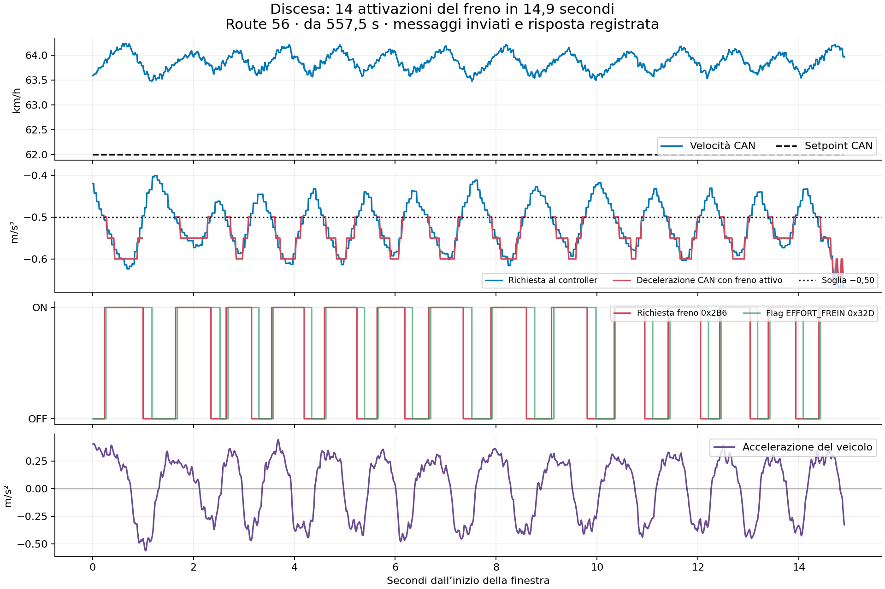
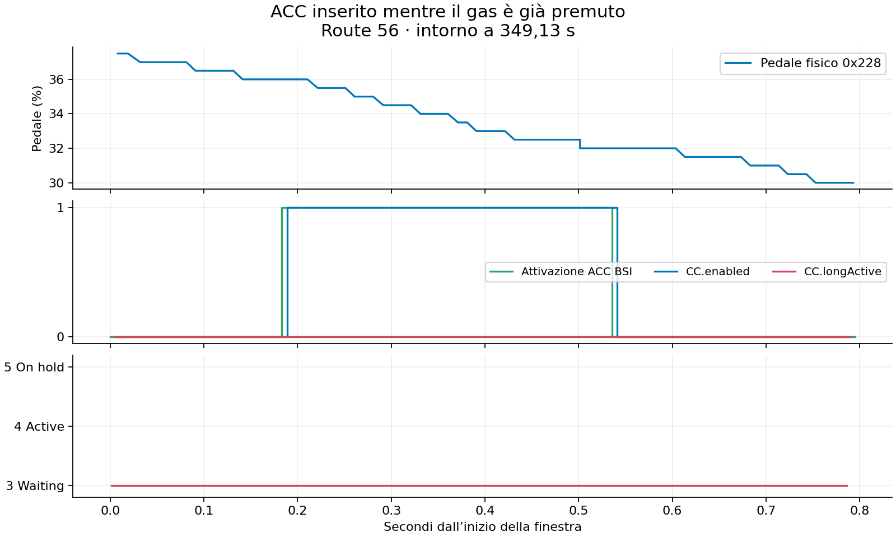

# Route 52–57: frenata in discesa e inserimento ACC con gas

Analisi del 13 settembre 2026. Solo letture sul comma; nessuna modifica al controller, alla safety o al dispositivo durante questa analisi.

## Acquisizione

Scaricati tutti i rlog/qlog delle route 52–57: 34 segmenti, 68 file, 337.393.599 byte. Dimensioni e SHA-256 locali corrispondono ai valori letti sul comma prima del download.

File originali: `../../../log_analysis/logitudinal_tests/20260913/acc_downhill_52_57/`; inventario `acquisition_manifest.json`, verifica `acquisition_verification.json` nella stessa cartella.

| Route | Segmenti | Durata approssimativa | Configurazione |
| --- | ---: | ---: | --- |
| 52 / 536778ea41 | 1 | 24 s | efc60c45c, dashcam/passive, noOutput |
| 53 / c7fe48e14d | 9 | 514 s | c43766e24, PSA longitudinal |
| 54 / bd2570a037 | 2 | 101 s | c43766e24, PSA longitudinal |
| 55 / 9f9b1d209f | 4 | 182 s | c43766e24, PSA longitudinal |
| 56 / be50d375dd | 13 | 778 s | c43766e24, PSA longitudinal |
| 57 / b3465c5577 | 5 | 266 s | c43766e24, PSA longitudinal |

Sul comma confermati in lettura openpilot `c43766e242d8beeab6159bcdca9ff2bde0b523a3` e opendbc `d9847d29a41dd374945c9a0fcf3d362ec1bb0e38`. L'opzione `DisengageOnAccelerator=0` è presente negli initData di tutte le nuove route ed è ancora 0 sul dispositivo.

## Frenata a impulsi: evidenza confermata

Route 56, tempo relativo 557,5–572,4 s (origine logMonoTime 950,738935272 s), segmento 9:

- 14 attivazioni della richiesta freno in 14,9 secondi.
- Velocità CAN 63,47–64,23 km/h; setpoint CAN costante 62 km/h. Questi sono valori CAN, distinti dalla visualizzazione del quadro.
- ACC_STATUS sempre 4, CC.enabled/longActive sempre veri, pedali gas e freno sempre rilasciati; canValid sempre vero.
- Target controller −0,666…−0,401 m/s², continuamente negativo.
- Sotto −0,5 il controller attiva `MDD_DECEL_CONTROL_REQ`; sopra −0,5 lo spegne e manda il valore inattivo 2,05. La coppia GMP nei tratti senza freno arriva al limite −400 Nm.
- L'accelerazione osservata oscilla fra circa +0,45 e −0,56 m/s²; il flag CAN `EFFORT_FREIN` segue gli impulsi. È un flag, non una misura di pressione.
- 742 frame sendcan e 742 echi CAN bus 129 nel tratto, con intervalli massimi rispettivamente circa 28 e 33 ms. Panda controlsAllowed sempre vero, safetyRxChecksInvalid falso, safetyTxBlocked 0.
- Pitch stimato −0,092…−0,073 rad, compatibile con discesa; non è una misura indipendente della pendenza stradale.

La soglia netta in `opendbc/car/psa/carcontroller.py:_update_longitudinal` spiega direttamente l'alternanza dei comandi osservati. Non è una perdita della sessione radar o un blocco intermittente Panda in questa finestra.

Map resta inattivo. Vision è inattivo fino a circa 568,678 s, poi diventa attivo negli ultimi 3,7 s: gli impulsi esistono già da circa 11 s. Il target di velocità rimane 62 km/h quasi ovunque, con brevi riduzioni fino a 61,73 km/h nella coda. Non attribuire quindi l'intero tratto a Vision, ma neppure descriverlo come sempre inattivo.

## Confronto con ACC originale

La route 51 dashcam già acquisita contiene richieste di frenata attiva a −0,05, −0,10, −0,15, −0,20, −0,30 m/s² e anche 0, con `MDD_DECEL_TYPE=1`, `POTENTIAL_WHEEL_TORQUE_REQUEST=2`, `WHEEL_TORQUE_REQUEST=0`. Anche l'analisi precedente della route 49 documenta la risposta a frenate leggere.

Il codice attuale non può riprodurre questa modulazione: sia la scelta del controller sia la safety limitano il percorso freno alla zona −1…−0,5 m/s². Una correzione deve permettere una richiesta continua e leggera quando è necessario il freno, aggiornando coerentemente la safety. Spostare semplicemente la soglia o aggiungere un timer non definisce correttamente la transizione fra freno motore/GMP e freno di servizio. La scelta va verificata rispetto a pendenza e decelerazione disponibile senza freno.

I log bastano a diagnosticare questo difetto. Un nuovo giro dashcam non è necessario per dimostrare la discontinuità; potrà essere utile per validare il comportamento originale nella stessa discesa prima di tarare la nuova transizione. Nessuna nuova legge di controllo è stata implementata o validata sulla vettura con questa analisi.

## Inserimento ACC mentre il gas è già premuto

Sono presenti otto attivazioni BSI con pedale fisico positivo. In quattro, il gas rimane premuto e l'attivazione BSI viene revocata dopo circa 0,35–0,36 s, mentre viene inviato esclusivamente stato 3 Waiting:

| Route | Tempo relativo | Pedale all'attivazione | Durata attivazione BSI |
| --- | ---: | ---: | ---: |
| 54 | 42,109 s | 48,5% | 0,363 s |
| 56 | 349,133 s | 36,0% | 0,353 s |
| 56 | 612,596 s | 40,0% | 0,353 s |
| 57 | 115,676 s | 43,0% | 0,352 s |

CC.enabled diventa vero e longActive rimane falso per l'override gas, come previsto con DisengageOnAccelerator disattivato. Il controller PSA richiede però `(self.longitudinal_active or self.acc_on_hold)` per entrare in hold: all'inserimento iniziale entrambe sono false. La condizione esclude il caso richiesto dal guidatore.

Correzione determinata: `acc_on_hold = bool(acc_enabled and CS.out.gasPressed)`, mantenendo in acc_enabled le autorizzazioni correnti e i controlli di pedale freno, CAN e sessione. Non deve dipendere da un'attivazione longitudinale precedente. Il caso DisengageOnAccelerator attivo continua a seguire CC.enabled falso. I test che richiedono assenza di hold durante l'inserimento con gas devono essere corretti insieme al requisito.

Nei frame inviati delle route 53–57 non risultano richieste freno simultanee al pedale fisico 0x228 positivo, allineando all'ultimo campione CAN ricevuto. Non è dimostrato che il software ordini la frenata mentre il pedale risulta ancora premuto. Nella route 57, primo inserimento, il gas viene rilasciato subito e compare una richiesta freno successiva, circa due secondi dopo: distinguere questa sequenza dall'inserimento fallito con pedale mantenuto.

## Fault aggiuntivo da non confondere con l'inserimento

Nella route 56, a 704,60 s, compare `accFaulted` durante una frenata, senza gas né freno del guidatore. Lo genera `ACC_ETAT_DECEL_OR_ESP_STATUS=3` nel messaggio 0x32D; viene mostrato `Cruise Fault: Restart the Car` e CC.enabled si disattiva. Il bit separato `DEFAUT_ACC_FREIN` rimane 0. La richiesta freno era limitata a −1 m/s², mentre aEgo arriva intorno a −1,93 m/s² nella finestra 700–705 s. Il motivo ECU di questa transizione non è stabilito e non va attribuito automaticamente al pedale, né mascherato eliminando il controllo fault.

## Riproduzione e limiti

`extract.py` decodifica rlog, CAN ricevuti, sendcan, target, pedali e stato. `analyze.py`, `detail.py` e `plot.py` producono metriche e grafici; usano gli originali nella cartella indicata e array temporanei in `/tmp/psa-downhill-52-57/`. I campi enum SelfdriveState non riconosciuti dallo schema locale sono conservati come `stateRaw`; testi alert e booleani sono letti direttamente, evitando di perdere l'intero messaggio per un enum non noto.

Metriche salvate: `downhill_metrics.json` e `gas_engagement_metrics.json`. SHA-256 prova l'integrità del trasferimento; gli echi provano la trasmissione sul CAN. L'effetto osservato è descritto separatamente tramite velocità, accelerazione e risposta 0x32D. La registrazione non prova l'accettazione ECU di una futura modifica.
