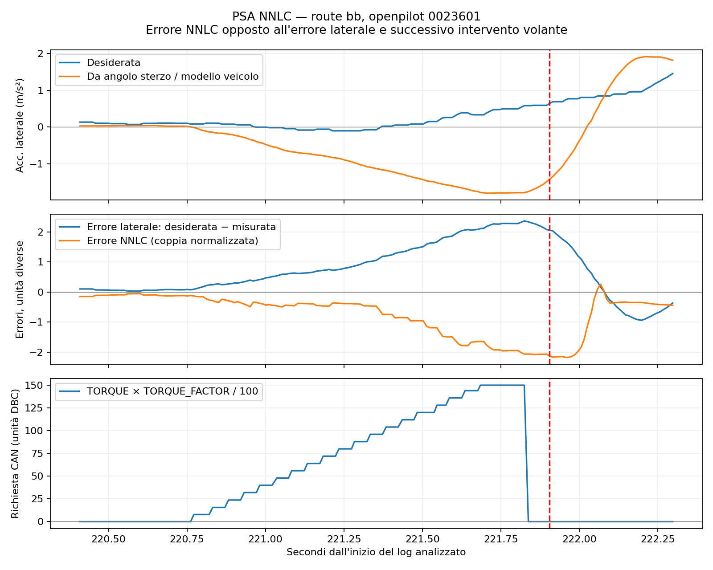

# Diagnosi NNLC PSA — ultima route bb

Analisi del 1 ottobre 2026. L'inversione segnalata è visibile nei log: il controllo NNLC genera un errore di coppia di segno opposto all'errore laterale e il comando amplifica lo scostamento. Il modello PSA installato è incompatibile con il contratto NNLC corrente per ordine degli ingressi e segno dell'uscita.

## Acquisizione e versione

- Dispositivo `comma@192.168.88.29`, accesso esclusivamente in lettura.
- Route `000000bb--2d3dbf3a70`, segmenti 0–6: 7 rlog e 7 qlog scaricati; tutti i 14 SHA256 coincidono con quelli remoti.
- Openpilot `0023601793b4d32369a1b3066e8cbc2e4d1db816`; opendbc `4d68f2632c32a72b8d31b63a6e6786abc2b34d05`; neural-network-data `ae29a1a3f5ebb4a3ab921bd1af513eedfc63318e`.
- Parametro NNLC letto sul dispositivo: `NeuralNetworkLateralControl=1`. Modello registrato nei log: `PSA_PEUGEOT_3008`, fingerprint esatta.
- Codice NNLC, modello e schemi Cap'n Proto locali verificati con gli SHA256 remoti. Modello SHA256 `005ddd7c9261cc7b0e45de7d0dd9133148fc88e9491440568c60779ed80eff20`.
- Analizzati 36.893 messaggi controlsState, circa 370,6 secondi. I tempi qui sotto sono relativi al primo controlsState, usando logMonoTime. L'orologio del dispositivo non è affidabile.

Dati e risultati: [cartella acquisizione](../../../log_analysis/nnlc_review_20261001_bb/). Manifest e verifiche sono conservati lì.

## Episodio osservato

Nel segmento 3, circa 221 secondi dall'inizio:

| Tempo (s) | Velocità (km/h) | Lat. desiderata (m/s²) | Lat. da angolo sterzo (m/s²) | Errore NNLC | Coppia attuatore | CAN TORQUE | Factor |
|---:|---:|---:|---:|---:|---:|---:|---:|
| 220,901 | 62,65 | +0,076 | −0,224 | −0,349 | +1,000 | +24 | 99 |
| 221,203 | 62,45 | −0,060 | −0,813 | −0,469 | +1,000 | +72 | 100 |
| 221,605 | 62,19 | +0,308 | −1,621 | −1,608 | +1,000 | +136 | 100 |

L'errore laterale `desiderata − misurata` è positivo e cresce; l'errore NNLC è negativo e cresce in modulo. L'angolo sterzo passa da +1,1° a +17°. EPS_STATE_LKA è 3; steeringPressed è falso nei tre campioni. La coppia conducente nel primo campione è circa +0,022, quindi molto piccola. La richiesta CAN viene azzerata intorno a 221,85 s e subito dopo diventa vero steeringPressed, con forte coppia conducente opposta.

Nell'intervallo 220,8–221,8 s: 20 richieste 0x3F2 bus 0 e 20 echo bus 128 con valori corrispondenti; nessun frame rifiutato bus 192. L'echo conferma l'invio da Panda; la risposta dello sterzo è documentata dall'angolo registrato. L'accelerazione laterale riportata da torqueState è calcolata dall'angolo sterzo e dal modello veicolo, non una misura indipendente dell'IMU.

## Due incompatibilità riprodotte

**Ordine ingressi.** Il JSON dichiara `[v_ego, actual_lateral_accel, roll, … storia/futuro accel … storia/futuro roll … lateral_jerk]`. La NNLC corrente passa `[v_ego, lateral_accel, jerk/friction_input, roll, … storia/futuro accel … storia/futuro roll]`. Jerk passa dal posto 18 al posto 3 e gli altri ingressi vengono spostati. Entrambi hanno 18 valori: il caricamento riesce, ma normalizzazione e pesi ricevono grandezze diverse da quelle dichiarate. NNTorqueModel ignora input_vars e valuta per posizione.

**Segno uscita.** Anche fornendo il vecchio ordine corretto, il modello restituisce coppia interna con pendenza negativa rispetto all'accelerazione laterale. Probe con la classe NNTorqueModel effettiva, 72 km/h, roll e jerk zero, accelerazioni temporali costanti:

| Accel. laterale (m/s²) | Uscita con ordine JSON | Uscita con ordine runtime corrente |
|---:|---:|---:|
| −0,5 | +0,1786 | +1,1065 |
| +0,5 | −0,1560 | −1,1172 |

Il controller richiede coppia interna crescente con l'accelerazione laterale; LatControlTorque applica poi `return -output_torque`. Il modello produce già il segno della coppia esterna, provocando una seconda inversione. Il probe conferma la pendenza negativa anche a 54, 90 e 108 km/h. Il riordino da solo lascia il segno errato; una sola inversione lascia gli ingressi errati.

Riferimenti codice nel checkout installato/localmente corrispondente: `nnlc.py:122–154`, `model.py:69–70`, `latcontrol_torque.py:119–122`; nel port PSA `carcontroller.py:676–686` e `psacan.py:44` conservano il segno della coppia richiesta fino al messaggio CAN.

Il training extractor locale contiene già `torque_output = -ts.output`, introdotto nel commit `9865062a` del 31 agosto. Il JSON installato dichiara un timestamp modello del 29 giugno. Questo è coerente con un modello precedente alla correzione del target; la provenienza esatta del suo dataset non è stata verificata.

## Intervento da valutare

Preparare un modello PSA compatibile con l'ordine NNLC corrente e con la convenzione della coppia interna; verificare offline entrambi i requisiti e la risposta all'errore prima della prova su vettura. La coppia CAN globale del port PSA non è il punto della correzione. Una modifica del modello/controller richiede un intervento successivo autorizzato.

Per l'uso attuale, tenere NNLC disattivata. Questa analisi non ha modificato codice prodotto, modello, parametri o software sul comma. Le sole scritture sono log scaricati, script di analisi e questo rapporto locale. Nessuna correzione o validazione su vettura è stata eseguita.
