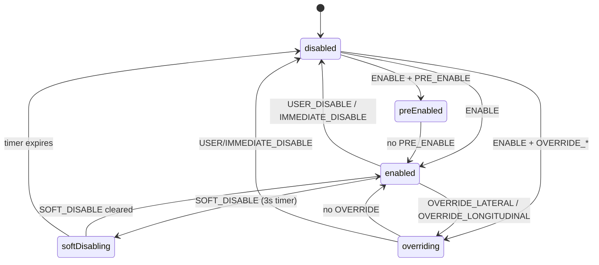

# Engagement state machine

`selfdrived` decides **whether openpilot is engaged and whether the actuators are live**. It gathers `Events` from the whole stack each cycle and runs a `StateMachine` (`selfdrived/state.py`) whose `update(events)` returns `(enabled, active)`. It publishes `selfdriveState` + `onroadEvents`; `controlsd` reads `selfdriveState` to know if it may command lateral/longitudinal.

## States (`log.SelfdriveState.OpenpilotState`)

- `ENABLED_STATES = {preEnabled, enabled, softDisabling, overriding}` → `enabled=True`.
- `ACTIVE_STATES = {enabled, softDisabling, overriding}` → `active=True` (**actuators live**).
- `preEnabled` is enabled-but-not-actuating (waiting on a `PRE_ENABLE` condition).
- `softDisabling` gives a `SOFT_DISABLE_TIME = 3 s` grace before dropping to `disabled`.
- `overriding` = engaged but the driver is steering/accelerating over openpilot.
- `USER_DISABLE` / `IMMEDIATE_DISABLE` always win from any non-disabled state.

## Event types (`ET`, `events.py`)

Events carry an alert type that drives the transition: `ENABLE`, `NO_ENTRY`, `PRE_ENABLE`, `USER_DISABLE`, `IMMEDIATE_DISABLE`, `SOFT_DISABLE`, `OVERRIDE_LATERAL`, `OVERRIDE_LONGITUDINAL`, plus `WARNING` / `PERMANENT` (alerts only). `NO_ENTRY` blocks engaging while showing why. Car-specific events come from `CarSpecificEvents(CP)`.

## MADS (sunnypilot) — decoupled lateral/longitudinal

sunnypilot's **Modular Assistive Driving System** (`ModularAssistiveDrivingSystem`, `sunnypilot/mads/`) runs a **parallel** state machine (`sunnypilot/mads/state.py`) so **lateral control can be engaged independently of longitudinal** (e.g. always-on lane keeping without ACC). Differences vs. the base machine:

- Its states use **`paused`** in place of `preEnabled`: `ENABLED_STATES = {paused, enabled, softDisabling, overriding}`; `ACTIVE_STATES = {enabled, softDisabling, overriding}`.
- It reuses openpilot's `soft_disable_timer` (`self.ss_state_machine`) so soft-disable timing stays in sync.
- Certain gears keep it in a silent `paused` instead of disabling (`GEARS_ALLOW_PAUSED` / `GEARS_ALLOW_PAUSED_SILENT`, e.g. reverse/brake-hold/wrong-gear).

On the sunny build this is what actually decides `CC.latActive` for the PSA port — lateral can be active while the 3008's longitudinal stays on stock ACC ([longitudinal-control.md](longitudinal-control.md), [../entities/psa-peugeot-3008.md](../entities/psa-peugeot-3008.md)).

## Related

- [runtime-pipeline.md](runtime-pipeline.md) — selfdrived's wide subscription set and `selfdriveState`/`onroadEvents` outputs.
- [driving-model.md](driving-model.md) — `modelV2.meta` disengage predictions feed some events.
