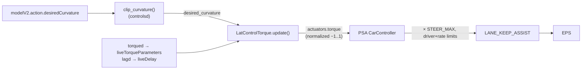

# Lateral control

openpilot steers by choosing a **desired path curvature** from the driving model, then a lateral controller turns that curvature into an actuator command the car's EPS accepts. Which controller runs is chosen by `CP.steerControlType` in `controlsd.py`:

| `steerControlType` | Controller | Command to car |
| --- | --- | --- |
| `angle` | `LatControlAngle` | a steering angle |
| `pid` | `LatControlPID` | torque via PID on angle |
| `torque` | `LatControlTorque` | torque via lateral-accel PID | ← **PSA 3008** |

The Peugeot 3008 uses **torque** ([../entities/psa-peugeot-3008.md](../entities/psa-peugeot-3008.md)).

## The torque control flow



`LatControlTorque` works in **lateral-acceleration space**, not torque space directly, because achieved lateral accel correlates with rack torque roughly independent of speed (see the module's own comment). Per cycle (`latcontrol_torque.py`):

1. **Setpoint** = `desired_curvature × vEgo²` (future desired lateral accel), buffered.
2. **Measurement** = `measured_curvature × vEgo²`, where `measured_curvature = -VM.calc_curvature(steeringAngle - angleOffset, vEgo, roll)`.
3. **Delay compensation**: `delay_frames = clip(lat_delay/dt + 1, …)`; the setpoint actually used is the buffered value `delay_frames` in the past, so the command aligns with when the car will respond. `lat_delay` comes from the learned lag (below).
4. **Feedforward** `ff` = roll-gravity-compensated future lateral accel − `latAccelOffset` + `get_friction(error + jerk·JERK_GAIN, …)`.
5. **PID** in lat-accel space: speed-scheduled `KP` (`KP_INTERP` over `INTERP_SPEEDS`; very high gain at low speed), `KI=0.15`; integrator frozen when `steer_limited_by_safety`, `steeringPressed`, or `vEgo < 5`.
6. **Convert to torque**: `output_torque = torque_from_lateral_accel(output_lataccel, torque_params)`; returns `-output_torque` (left is positive in this convention). This normalized torque becomes `actuators.torque`.

The PSA `CarController` then does `round(actuators.torque × STEER_MAX)` and applies driver/rate limits (`apply_driver_steer_torque_limits`) before sending `LANE_KEEP_ASSIST` — see the [PSA port](../entities/psa-peugeot-3008.md).

## Delay compensation chain (what `steerActuatorDelay` feeds)

The per-car `steerActuatorDelay` (PSA `interface.py`: **0.376803 s**) is only the **seed**; the actual delay is learned live:

```
CP.steerActuatorDelay (per-car seed, PSA 0.376803)
   → lagd.py: initial_lag = steerActuatorDelay + 0.2
   → lagd learns actual actuator lag → publishes liveDelay.lateralDelay
   → controlsd: lat_delay = liveDelay.lateralDelay + LAT_SMOOTH_SECONDS
   → LatControlTorque: delay_frames → picks the delay-compensated setpoint
```

So tuning `steerActuatorDelay` mainly changes the starting point for `lagd`; on a device that has learned, `liveDelay` dominates. Reset it with the other learned params on-device ([../../docs/device-operations.md](../../docs/device-operations.md)).

## Torque tuning (latAccelFactor / latAccelOffset / friction)

Default conversion is **linear** (`opendbc/car/interfaces.py`):
- `torque_from_lateral_accel_linear = lateral_accel / latAccelFactor`
- `lateral_accel_from_torque_linear = torque × latAccelFactor`

`configure_torque_tune(candidate, tune)` loads `LAT_ACCEL_FACTOR`, `FRICTION`, etc. from the `torque_data/` tables into `CP.lateralTuning.torque`. PSA calls it in `_get_params`. At runtime **torqued** learns `latAccelFactor`, `latAccelOffset`, `friction` from driving and publishes `liveTorqueParameters`; `controlsd` pushes the filtered values into the controller via `update_live_torque_params(...)`. `friction` is applied through `get_friction` (`opendbc/car/lateral.py`), scaled by `friction × latAccelFactor` around a lateral-accel deadzone.

This is why resetting `LiveTorqueParameters` after changing `STEER_MAX`/tuning forces re-learning of `latAccelFactor` ([../../docs/device-operations.md](../../docs/device-operations.md)).

## NNLC — neural network lateral control (sunnypilot)

`LatControlTorque` holds a `LatControlTorqueExt` (`sunnypilot/selfdrive/controls/lib/latcontrol_torque_ext.py`) that can **override the torque params and the output torque**. This is the hook where **NNLC** (`sunnypilot/selfdrive/controls/lib/nnlc/`) replaces the linear `torque_from_lateral_accel` with a per-car neural model. Sunny-only; the comma variant uses the linear conversion.

### The model is trained OFFLINE, not on-device

An NNLC model is a `.json` in the `neural_network_data` submodule holding the net (`layers`), input normalization (`input_mean`/`input_std`/`input_vars`, `input_size`), `output_size`, plus `model_test_loss` and a training timestamp. Those last two only exist because it was **trained offline** (from collected drive logs, via sunnypilot's training tooling) and committed to the data repo. **The device does not train NNLC.** What the device learns live from driving is the linear torque tuning (`torqued` → `latAccelFactor`/`latAccelOffset`/`friction`) and lag (`lagd` → `liveDelay`) — that's the autoapprendimento feeding whichever base controller runs. Uploaded logs feed the *offline* NNLC dataset; they don't produce the model on the device.

### Model matching (`get_nn_model_path`, `nnlc/helpers.py`)

Resolves a model by fuzzy-matching `car_fingerprint` (optionally `+ eps_fw`) against the `.json` filenames in `neural_network_data/neural_network_lateral_control/` (highest `SequenceMatcher` similarity; `exact_match ≥ 0.99`), falling back to `torque_data/substitute.toml` then `MOCK.json`. The path is resolved and stored in `CP_SP.neuralNetworkLateralControl.model` **always**, but the model is only *used* when the `NeuralNetworkLateralControl` param is on.

### PSA 3008 status

`PSA_PEUGEOT_3008.json` exists **only in `cristianku/neural-network-data`** (not in sunnypilot upstream), so it is present only on the `peugeot-3008-sunny*` branches that wire the submodule to Cristian's data repo ([../../docs/branches-and-submodules.md](../../docs/branches-and-submodules.md)). On a vanilla sunnypilot the 3008 would fall back to MOCK/substitute. When `NeuralNetworkLateralControl` is off, the model matches but is inactive, and the base controller (v0, above) runs with live `torqued`/`lagd` learning.

## Torque controller v0 vs v1 (sunnypilot)

There are two `LatControlTorque` implementations, same skeleton (curvature error in lateral-accel space → PID → `torque_from_lateral_accel`) but different delay/jerk handling and tuning. `pid_log.version` (0 or 1) shows which ran.

- **v1** = upstream comma: `selfdrive/controls/lib/latcontrol_torque.py` (`VERSION=1`).
- **v0** = sunnypilot's retained older version: `sunnypilot/selfdrive/controls/lib/latcontrol_torque_v0.py` (`VERSION=0`).

| Aspect | v0 | v1 |
| --- | --- | --- |
| Setpoint / delay comp | setpoint = **current** future desired lat-accel; the delayed buffered value only feeds jerk | setpoint = **delay-compensated** buffered value `buffer[-delay_frames]` (delay comp moved into the tracking error) |
| Lateral jerk | `(future − expected) / lat_delay` over the delay window | dedicated **lookahead** (`JERK_LOOKAHEAD_SECONDS = 0.19`) central difference + low-pass `jerk_filter` |
| Where jerk goes | folded into the setpoint | into **friction**: `get_friction(error + JERK_GAIN·jerk, …)`, `JERK_GAIN = 0.3` |
| Derivative | measurement-rate filter plumbed into PID, but `KD = 0` (inert) | removed entirely (no D path) |
| Gains | `KP = 1.0`, `KI = 0.3` | `KP = 0.8`, `KI = 0.15` (gentler, more feedforward-reliant) |
| Friction threshold | local `0.3` | opendbc `FRICTION_THRESHOLD = 0.2` |
| `delay_frames` | `clip(lat_delay/dt, 1, N)` | `clip(lat_delay/dt + 1, 1, N)` (+1; appends to buffer before reading) |

Net: **v1** is smoother / more predictive (delay-compensated setpoint + filtered jerk lookahead, lower gains, feedforward-led); **v0** is more reactive (higher gains, jerk baked into the setpoint).

### Which one runs

Selected in `sunnypilot/selfdrive/controls/controlsd_ext.py::initialize_lateral_control`:
- **Default** (`EnforceTorqueControl` unset/false) → **v0** for torque cars, with a code FIXME: *"revert when upstream fixes tuning issues with v1."* So on a stock sunny build the **PSA 3008 currently runs v0**.
- `EnforceTorqueControl = 1` **and** `TorqueControlTune != 0` → **v1** (the upstream `lac` built in `controlsd.py`).
- Comma/upstream openpilot always uses v1.

Both knobs are plain params (`common/params_keys.h`, `PERSISTENT | BACKUP`, `TorqueControlTune` options `v1.0`/`v0.0`), exposed in the **device UI** (Settings → Steering → torque settings) and in **sunnylink** (`sunnypilot/sunnylink/settings_ui*`). The version is therefore chosen at runtime from settings/sunnylink — **nothing per-car is needed in the port's `interface.py`**; the choice is fingerprint-independent. The interface only has to declare the car as torque-steer (`steerControlType = torque` + `configure_torque_tune`), which the PSA port already does ([../entities/psa-peugeot-3008.md](../entities/psa-peugeot-3008.md)).

**Caveat (matters for the 3008 sunny):** `EnforceTorqueControl` and `NeuralNetworkLateralControl` are **mutually exclusive** — `ui_state._enforce_constraints()` turns both off if both are set. NNLC runs as an override on top of the base controller, and when NNLC is on the base controller is **v0**. So selecting **v1** (EnforceTorqueControl + `TorqueControlTune = v1.0`) implies **NNLC off**.

## Safety bound

Whatever torque the controller asks for, the panda [safety model](safety-model.md) independently clamps the CAN that leaves — the controller cannot exceed `STEER_MAX`/rate limits even if it wants to.

## Related

- [runtime-pipeline.md](runtime-pipeline.md) — where controlsd/torqued/lagd sit and their messages.
- [car-interface-contract.md](car-interface-contract.md) — `steerControlType` and where tuning is set.
- [../entities/psa-peugeot-3008.md](../entities/psa-peugeot-3008.md) — the torque→CAN side and EPS state machine.
- [../entities/psa-3008-torque-oscillation-2026-07.md](../entities/psa-3008-torque-oscillation-2026-07.md) — field case study: how a nonlinear actuator gain + mis-reported `actuatorsOutput.torque` corrupts torqued's friction learning and produces a 0.5–0.7 Hz lane-center limit cycle.
