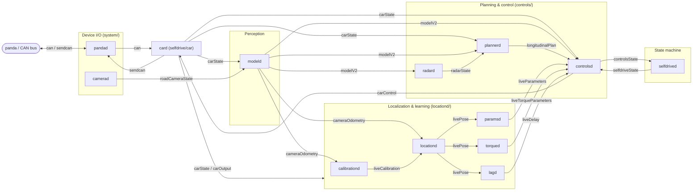

# Runtime pipeline

All daemons communicate only through **cereal** messages over the **msgq** transport. This page is the verified message graph: who publishes what, who subscribes. Edges below are taken from each daemon's `PubMaster`/`SubMaster` declarations; topic metadata (frequency, decimation) from `cereal/services.py`.

## Message-flow graph

Backbone only (the highest-signal edges). Full publisher/subscriber lists are in the table below.

Read it as one loop: **CAN → `card` → `carState` → (perception/localization/planning) → `controlsd` → `carControl` → `card` → `sendcan` → CAN**, with the panda safety layer clamping the CAN that actually leaves ([safety-model.md](safety-model.md)).

## Daemon publish/subscribe (verified)

| Daemon | Publishes | Subscribes (key) |
| --- | --- | --- |
| **card** (`selfdrive/car/card.py`) | `sendcan`, `carState`, `carParams`, `carOutput`, `liveTracks` (+ `carStateSP`, `carParamsSP`) | `pandaStates`, `carControl`, `onroadEvents` (+ `carControlSP`, `longitudinalPlanSP`) |
| **modeld** (`selfdrive/modeld/modeld.py`) | `modelV2`, `drivingModelData`, `cameraOdometry`, `modelDataV2SP` | `roadCameraState`, `carState`, `liveCalibration`, `driverMonitoringState`, `carControl`, `liveDelay`, `deviceState` |
| **plannerd** (`controls/plannerd.py`) | `longitudinalPlan`, `driverAssistance`, `longitudinalPlanSP` | `modelV2`, `carState`, `carControl`, `controlsState`, `liveParameters`, `radarState`, `selfdriveState`, `liveMapDataSP` |
| **controlsd** (`controls/controlsd.py`) | `carControl`, `controlsState` | `modelV2`, `longitudinalPlan`, `lateralManeuverPlan`, `selfdriveState`, `carState`, `carOutput`, `liveParameters`, `liveTorqueParameters`, `liveDelay`, `livePose`, `liveCalibration`, `driverMonitoringState`, `driverAssistance`, `onroadEvents` |
| **radard** (`controls/radard.py`) | `radarState` | `modelV2`, `carState`, `liveTracks` |
| **calibrationd** | `liveCalibration` | `cameraOdometry`, `carState` |
| **locationd** | `livePose` | `cameraOdometry`, `carState`, `liveCalibration` |
| **paramsd** | `liveParameters` | `livePose`, `liveCalibration`, `carState` |
| **torqued** | `liveTorqueParameters` | `carControl`, `carOutput`, `carState`, `liveCalibration`, `livePose`, `liveDelay` |
| **lagd** | `liveDelay` | `livePose`, `liveCalibration`, `carState`, `controlsState`, `carControl` |
| **dmonitoringd** | `driverMonitoringState` | `driverStateV2`, `liveCalibration`, `carState`, `selfdriveState`, `modelV2` |
| **selfdrived** | `selfdriveState`, `onroadEvents` (+ SP) | `carControl`, `carOutput`, `controlsState`, `modelV2`, `radarState`, `liveParameters`, `deviceState`, `pandaStates`, … |

## Timing (from `cereal/services.py`)

- `can` / `sendcan` / `carState` / `carControl` / `controlsState`: **100 Hz** — the control loop rate.
- `modelV2` / `cameraOdometry` / `radarState` / `livePose` / `liveParameters`: **20 Hz**.
- `liveCalibration` / `liveTorqueParameters` / `liveDelay`: **4 Hz** (slow-learned).
- `carParams`: ~0.02 Hz (once, effectively static).

A car port can further decimate its own CAN TX: PSA sends steering every `STEER_STEP = 5` frames → ~20 Hz ([../entities/psa-peugeot-3008.md](../entities/psa-peugeot-3008.md)).

## Notes

- The SP-suffixed topics (`carControlSP`, `longitudinalPlanSP`, `modelDataV2SP`, `liveMapDataSP`, …) are sunnypilot's parallel channels; the base flow above is upstream.
- Persistent state (not messages) lives in `common/params` → `/data/params/d/` ([../../docs/device-operations.md](../../docs/device-operations.md)).
