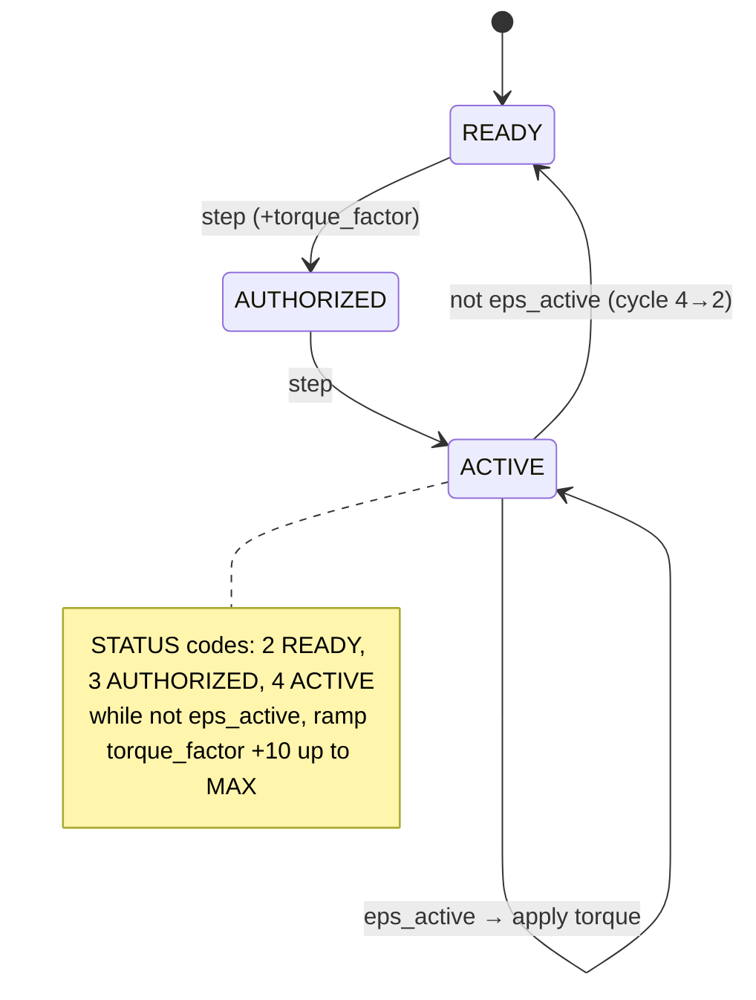
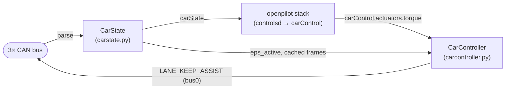

# PSA Peugeot 3008 port

Cristian's car port. Brand `psa`, platform `CAR.PSA_PEUGEOT_3008`, in `opendbc/opendbc/car/psa/`. Implements the [car interface contract](../concepts/car-interface-contract.md). Sibling platforms `PSA_PEUGEOT_208`/`PSA_PEUGEOT_508` exist in the same files but 3008 is the focus and gets almost all the special-casing.

`CarSpecs`: mass **1577 kg**, wheelbase **2.675 m**, steerRatio **17.69**, tireStiffnessFactor **0.996044**. DBC: **`psa_aee2010_r3`**. Harness: `CarHarness.psa_a`. Safety: `SafetyModel.psa` ([safety-model.md](../concepts/safety-model.md)).

## Files

| File | Lines | Role |
| --- | --- | --- |
| `interface.py` | 44 | `CarInterface._get_params` — car description + tuning. |
| `carstate.py` | 138 | `CarState.update` — CAN → `structs.CarState`. |
| `carcontroller.py` | 223 | `CarController.update` — `CarControl` → CAN (the bulk of the port). |
| `psacan.py` | 133 | CAN message builders + PSA checksum. |
| `values.py` | 110 | `CAR`, `CarControllerParams`, `LKAS_LIMITS`, DBC map, FW query, docs. |
| `fingerprints.py` | 72 | Fingerprint / FW-version tables. |

## CAN bus layout

All three buses use the same DBC (`psa_aee2010_r3`), split by function (`carstate.get_can_parsers`):

| `Bus` | idx | Carries |
| --- | --- | --- |
| `Bus.main` | 0 | Powertrain/EPS/body: wheel speeds, gas, steering, `IS_DAT_DIRA` (EPS). **LKA TX goes here.** |
| `Bus.adas` | 1 | ADAS/radar: `HS2_*` cruise/MDD/AEB, yaw rate, standstill. ACC/long TX would go here. |
| `Bus.cam` | 2 | Camera/BSI: brake, gear, blinkers, doors, seatbelt. `create_steering_hold` TX here. |

## carstate.py — signals read (→ CarState)

| CarState field | Source signal |
| --- | --- |
| wheel speeds / `vEgo` | `Dyn4_FRE` P263–P266 (`parse_wheel_speeds`) |
| `yawRate` | `HS2_DYN_UCF_MDD_32D.VITESSE_LACET_BRUTE` (deg→rad) |
| `standstill` | `HS2_DYN_UCF_MDD_32D.VEHICLE_STANDSTILL` |
| `gasPressed` | `Dyn5_CMM.P334_ACCPed_Position > 0` |
| `brakePressed` | `Dat_BSI.P013_MainBrake` |
| `parkingBrake` | `Dyn_EasyMove.P337_Com_stPrkBrk` |
| `steeringAngleDeg` / `steeringRateDeg` | `STEERING_ALT.ANGLE` / `.RATE` (sign inverted via `RATE_SIGN`: 0=CW/right, 1=CCW/left) |
| `steeringTorque` | `IS_DAT_DIRA.EPS_TORQUE × 10` (driver torque only; already EPS-smoothed) |
| `steeringPressed` | `abs(steeringTorque) > LKAS_LIMITS.STEER_THRESHOLD` (=5) |
| `eps_active` *(internal)* | `IS_DAT_DIRA.EPS_STATE_LKA == 3` (0 Unauth,1 Auth,2 Avail,**3 Active**,4 Defect) |
| `cruiseState.speed`/`.enabled` | `HS2_DAT_MDD_CMD_452.SPEED_SETPOINT` / `.RVV_ACC_ACTIVATION_REQ` |
| `accFaulted` | `HS2_DYN_UCF_MDD_32D.ACC_ETAT_DECEL_OR_ESP_STATUS == 3` |
| `gearShifter` | `Dat_BSI.P103_Com_bRevGear` (reverse/drive only) |
| blinkers / blindspot / `stockAeb` / doors / seatbelt | `HS2_DAT7_BSI_612`, `HS2_DYN_MDD_ETAT_2F6.BLIND_SENSOR`, `HS2_DYN1_MDD_ETAT_2B6.AUTO_BRAKING_STATUS`, `Dat_BSI`, `RESTRAINTS` |

It also caches raw frames (`is_dat_dira`, `steering`, `hs2_dat_mdd_cmd_452`, `HS2_DYN_MDD_ETAT_2F6`) so the controller can re-send them with modified fields.

## carcontroller.py — lateral control (torque)

`steerControlType = torque`. Every `STEER_STEP` (5) frames → ~20 Hz, it builds `LANE_KEEP_ASSIST` on bus 0 (`create_lka_steering`). The interesting part is the **EPS activation state machine**, because the PSA EPS must be walked through states before it accepts torque:

When `CS.eps_active` is true: `status = 4`, torque = `apply_driver_steer_torque_limits(round(actuators.torque × STEER_MAX), last, driverTorque, params, STEER_MAX)`, and `torque_factor` is scaled linearly `MIN…MAX` by `|torque|/STEER_MAX`. `new_actuators.torque` / `torqueOutputCan` report the applied value back up. EPS only assists **≥ 50 km/h** (`LKAS_LIMITS.DISABLE_SPEED`), hence `minSteerSpeed`.

### Steering limits (`CarControllerParams`, `values.py`)

`STEER_MAX = 250`, `STEER_STEP = 5`, `STEER_DELTA_UP = 10`, `STEER_DELTA_DOWN = 38`, `STEER_DRIVER_MULTIPLIER/FACTOR = 1`, `STEER_DRIVER_ALLOWANCE = 50`, `MAX_TORQUE_FACTOR = 100`, `MIN_TORQUE_FACTOR = 25`. Higher `STEER_MAX` + lower factor = finer torque resolution at the same peak. These must agree with the PSA [safety model](../concepts/safety-model.md).

## carcontroller.py — longitudinal control (currently OFF)

Longitudinal is **entirely commented out** (the "ELKOLED" block): ACC messages `HS2_DYN1_MDD_ETAT_2B6` / `HS2_DYN_MDD_ETAT_2F6` (bus 1, 50 Hz), an accel→wheel-torque lookup, lead-distance bars from `modelV2.leadsV3`, and radar-ECU disable via UDS `tester_present`. Matches `interface.py`: `openpilotLongitudinalControl = alpha_long`, `alphaLongitudinalAvailable = False`, `radarUnavailable = True`. So today the port is **lateral-only**; long is experimental scaffolding.

Also parked (commented): periodic `create_steering_hold` (bus 2, keep EPS engaged) and `create_driver_torque` (spoof small driver torque). `create_request_takeover` exists for the <50 km/h takeover alert but is disabled.

## Key CarParams (`interface.py`)

`brand='psa'`; `steerControlType=torque` + `configure_torque_tune`; `steerActuatorDelay=0.376803`; `steerLimitTimer=0.1`; `minSteerSpeed=DISABLE_SPEED×KPH_TO_MS`; `steerAtStandstill=False`; `radarUnavailable=True`; `openpilotLongitudinalControl=alpha_long`; `startingState=True`; `startAccel=1.0`.

## Identification

`FW_QUERY_CONFIG` issues UDS diagnostic-session + read-serial/version requests on buses 0/1/2 with `PSA_RX_OFFSET = -0x20`. Fingerprints in `fingerprints.py`. `psa_checksum` (in `psacan.py`) computes the 4-bit CAN checksum with a per-address init constant.

## Data flow (summary)

## Operational (Cristian's workflow)

- Branches / submodule wiring: [../../docs/branches-and-submodules.md](../../docs/branches-and-submodules.md).
- Build/ship skills: [../../docs/skills.md](../../docs/skills.md).
- Reset learned torque/lag/calibration on device: [../../docs/device-operations.md](../../docs/device-operations.md).

## Open threads

- **Longitudinal**: bring the commented ELKOLED ACC path into a testable state; document torque lookup + radar-disable once validated.
- **Torque tuning**: log `STEER_MAX` / `MAX_TORQUE_FACTOR` / `steerActuatorDelay` experiments and their `latAccelFactor` outcomes here.
- **EPS re-engage**: the <50 km/h takeover-request alert is stubbed — decide whether to enable.
