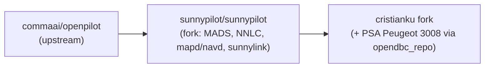
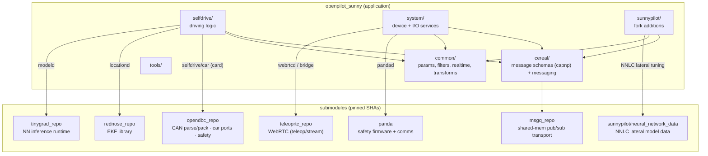

# openpilot_sunny

The full openpilot ADAS stack, sunnypilot flavor. Local checkout: `/Users/cristianku/GitHub/COMMA.AI/SUNNYPILOT/openpilot_sunny` (the 4th folder in `opendbc.code-workspace`). It is a fork of **sunnypilot/sunnypilot**, which forks **commaai/openpilot**.

openpilot is a set of ~50 independent processes (daemons) started by a **manager** and talking to each other only through **cereal** messages over the **msgq** shared-memory transport. There is almost no direct function calling between subsystems — the message graph *is* the architecture. To understand any feature, find which daemon publishes the message you care about and which subscribe to it. The live runtime graph is in [../concepts/runtime-pipeline.md](../concepts/runtime-pipeline.md).

## Fork lineage

commaai is the base ADAS stack; sunnypilot adds features (see `sunnypilot/` below); Cristian's fork does **not** modify the openpilot code itself — it only re-points the `opendbc_repo` (and `neural_network_data`) submodules to his branches. See [../../docs/branches-and-submodules.md](../../docs/branches-and-submodules.md).

## Dependency graph (repo + submodules)

Submodules are pinned by exact SHA (`160000 commit`). Each provides a capability the stack builds on:

The one to edit for the Peugeot work is **`opendbc_repo`** (→ [opendbc.md](opendbc.md)); the rest are consumed as-is.

## Top-level layout

| Dir | Role |
| --- | --- |
| `cereal/` | The messaging contract. `.capnp` schemas for every message + the `messaging` pub/sub API. `services.py` is the canonical registry of every topic with its logging flag, frequency, and decimation. If two daemons disagree about a field, the schema here is the truth. |
| `common/` | Shared library code used everywhere: `params` (persistent key/value on device at `/data/params/d/`), `filter_simple`, `pid`, `simple_kalman`, `realtime`/`ratekeeper` (scheduling), `transformations` (geometry). |
| `selfdrive/` | The driving logic — perception glue, localization, planning, control, the car bridge, monitoring, UI (see below). |
| `system/` | Device and I/O services: `camerad` (cameras), `sensord` (IMU), `pandad` (panda link), `loggerd`/`encoderd` (logging + video), `hardware/` (board abstraction), `manager/` (process orchestration + `process_config.py`), `updated` (OTA), `athena` (comma connect), `ui/`. |
| `sunnypilot/` | Fork additions (see below). |
| `tools/` | Dev tooling: `replay`, simulator, PlotJuggler, CI helpers, camera/joystick debug. |
| `docs/`, `third_party/`, `site_scons/`, `SConstruct` | Upstream docs, vendored deps, and the SCons build. |

## `selfdrive/` — driving logic

| Dir | Key processes | Role |
| --- | --- | --- |
| `car/` | **card** (`card.py`) | Instantiates the opendbc `CarInterface` for the fingerprinted car and is the *only* bridge between CAN and cereal: publishes `carState`/`carOutput`, subscribes `carControl`, emits `sendcan`. See [../concepts/car-interface-contract.md](../concepts/car-interface-contract.md). |
| `controls/` | **controlsd**, **plannerd**, **radard** | `controlsd` runs the lateral+longitudinal controllers → `carControl`; `plannerd` turns model output into `longitudinalPlan`; `radard` fuses radar (idle when `radarUnavailable`, as on PSA 3008). Controllers live in `controls/lib/`. |
| `modeld/` | **modeld**, **dmonitoringmodeld** | Vision/driving-model inference (tinygrad) → `modelV2`, `cameraOdometry`. sunnypilot adds `modeld_v2`/alternate `models`. |
| `locationd/` | **locationd**, **paramsd**, **torqued**, **lagd**, **calibrationd** | Localization (`livePose`) + the live-learned params: steering (`liveParameters`), torque (`liveTorqueParameters`), actuator lag (`liveDelay`), camera calibration (`liveCalibration`). These are what get reset on-device in [../../docs/device-operations.md](../../docs/device-operations.md). |
| `monitoring/` | **dmonitoringd** | Driver attention state (`driverMonitoringState`). |
| `pandad/` | **pandad** | USB/SPI link to the panda; `can`/`sendcan` + `pandaStates`. |
| `selfdrived/` | **selfdrived** | The engage/disengage state machine and event/alert aggregation (`selfdriveState`, `onroadEvents`). |
| `ui/` | **ui**, **soundd** | On-device UI and alerts. |

## `sunnypilot/` — fork additions

| Dir | Adds |
| --- | --- |
| `mads/` | **MADS** (Modular Assistive Driving System) — decouples lateral and longitudinal engagement; changes how the stack engages vs. stock openpilot. Base logic also in `opendbc/sunnypilot/mads_base.py`. |
| `neural_network_data/` | **NNLC** — neural-network lateral control model data (submodule → `cristianku/neural-network-data:master`). |
| `mapd/`, `navd/` | Map data daemon and navigation (`liveMapDataSP`, used by `plannerd`). |
| `models/`, `modeld_v2/` | Alternate/selectable driving models + model manager. |
| `sunnylink/` | sunnypilot's cloud link (registration, uploader). |
| `livedelay/`, `common/`, `system/`, `selfdrive/`, `tools/` | SP-side extensions layered onto the matching upstream dirs. |

## Notes

- The sunny variant is what runs on Cristian's comma device; NNLC uses `cristianku/neural-network-data:master`.
- Two opendbc entry points exist here: the `opendbc_repo` submodule (authoritative for the port) and a top-level `opendbc/` — mind which one you edit.
- Message names, frequencies and decimation come from `cereal/services.py`; the managed process list from `system/manager/process_config.py`.
